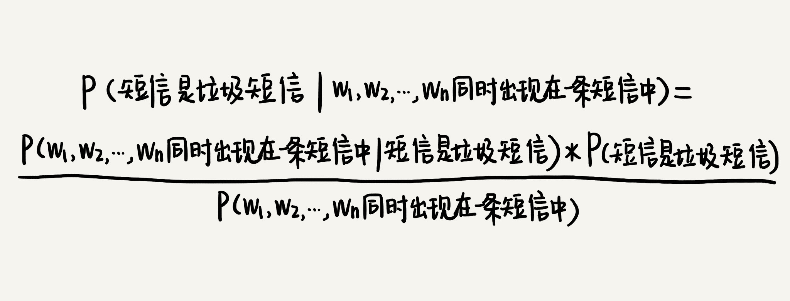
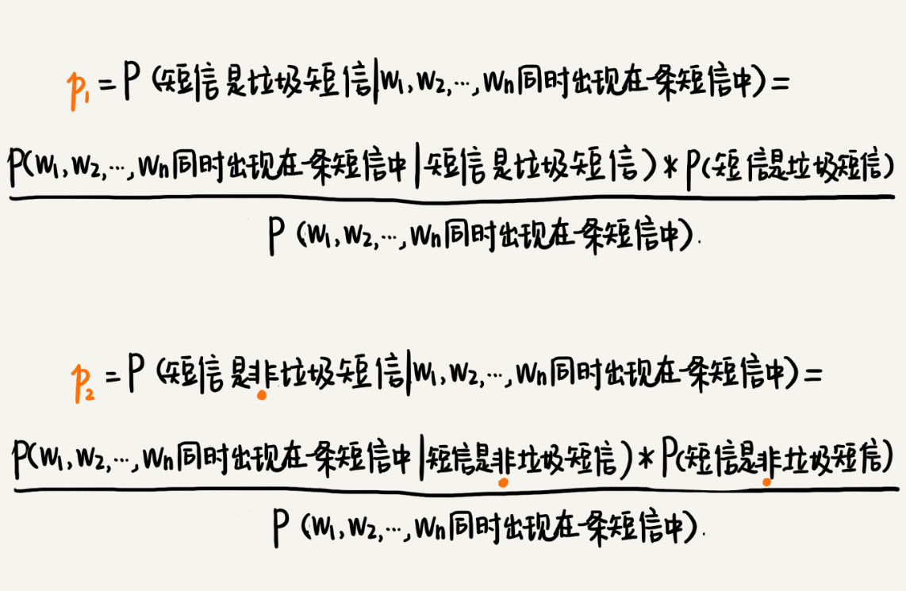
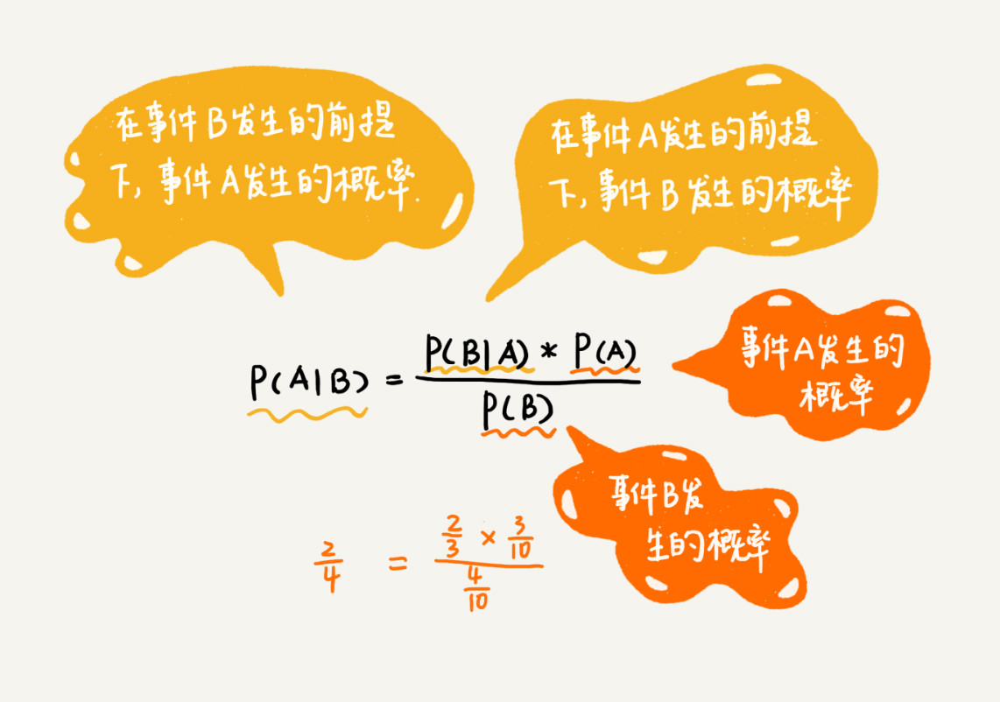

### 过滤短信功能

1. 基于黑名单的过滤器 
    * 收集用户提交的黑名单短信以及其他数据来源的黑名单, 布隆过滤器
2. 基于规则的过滤器
    * 指定一系列的黑名单规则,满足多个或者给每个打分,总分超过阈值的定义为垃圾短信
    * 但问题在于规则的制定有局限性, 一批人无法每时每刻去为规则做变动
    * 垃圾短信的发送者可以针对性指定短信
3. 基于概率统计的过滤器
    * 基础理论是基于朴素贝叶斯算法
    * 通过分词算法,将短信分为多个单词(w1,w2..wn)
    * 那么判定一个短信是否是垃圾短信这样一个问题,就变成了,判定同时包含这几个单词的短信是否是垃圾短信
    * P(短信是垃圾短信|w1,w2..wn同时出现在一个短信中) 表示短信是垃圾短信的可信程度
    
    
但此时有个问题:
`P（W1​，W2​，W3​，…，Wn​ 同时出现在一条短信中 | 短信是垃圾短信）`这个概率照样无法通过样本来统计得到

而此时基于[概率规则],可以将上面分解为每个单词出现在垃圾短信的概率并求乘积

上面是解决了计算概率的问题,但求出P(w1,w2..wn同时出现在一个短信中)的概率还是不好通过样本统计获取(`原因是样本数据有限`)

最终方案:
我们不仅计算在(w1,w2..wn同时出现在一个短信中)
* 短信为**垃圾短信**的概率p1,
* 也需要计算短信是**非垃圾短信**的概率p2

若p1为p2的`n`倍,就可以认定为垃圾短信了;

最终公式为: n = (P(w1...wn |垃圾短信)*P(短信是垃圾短信))/(P(w1...wn |非垃圾短信)*P(短信是非垃圾短信))
* 这里的**P(短信是垃圾短信)和P(短信是非垃圾短信)** 都可以在原来的统计样本中获得;
* **P(w1...wn |垃圾短信)和P(w1...wn |非垃圾短信)** 可以分别统计到每个单词在垃圾或非垃圾短信中出现的概率乘积

 
    
* * *
朴素贝叶斯算法:

* P(A)是在一系列事件中,出现A的概率
* P(B)是在一系列事件中,出现B的概率
* P(A|B)是在一系列B事件中,出现A的概率
* P(B|A)是在一系列A事件中,出现B的概率

* * *
概率规则:
> 独立事件发生的概率计算公式：P(A*B) = P(A)*P(B)
> 如果事件 A 和事件 B 是独立事件，两者的发生没有相关性，事件 A 发生的概率 P(A) 等于 p1，事件 B 发生的概率 P(B) 等于 p2，那两个同时发生的概率 P(A*B) 就等于 P(A)*P(B)。
